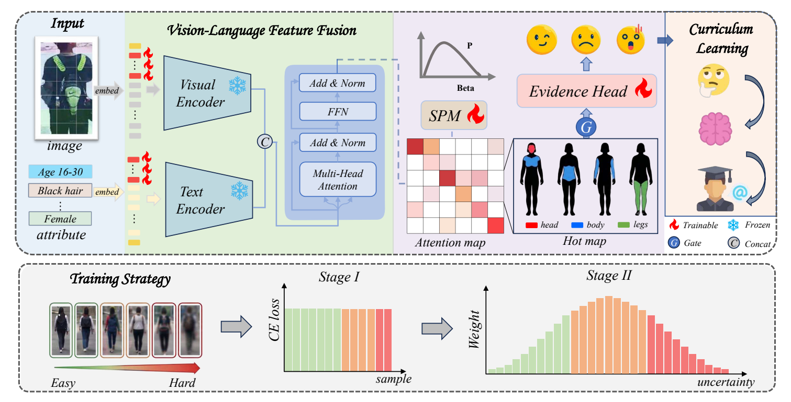
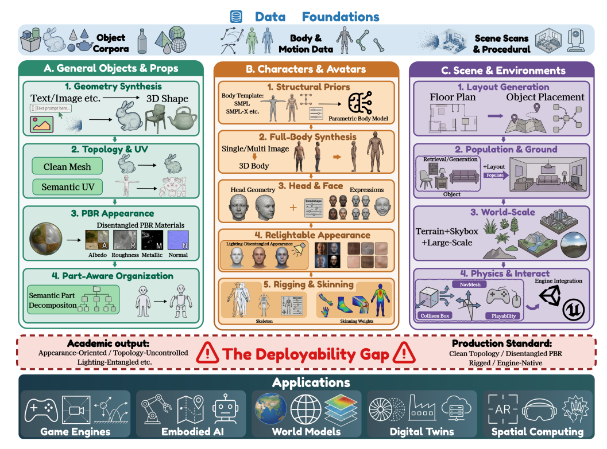

  <h1>Hi, I'm Zhuofan Lou (娄卓凡) 👋</h1>
  
<strong>Incoming Ph.D. Student at <em>Shanghai Jiao Tong University</em></strong>

  
<strong><em>Video Generation · 3D Generative Modeling · World Model</em></strong>

  
<em>I think, therefore I am</em>&nbsp;&nbsp;&nbsp;<em>— René Descartes</em>

  

    
    
    
  

## 🧬 Biography

I am an incoming Ph.D. student in <strong><em>Computer Science</em></strong> at <strong><em>Shanghai Jiao Tong University</em></strong>, advised by <a href="https://jhc.sjtu.edu.cn/~xiaohongliu/">Prof. Xiaohong Liu</a> and <a href="https://taohuang.info/">Prof. Tao Huang</a>. I will conduct my research in the <a href="https://multimedia.sjtu.edu.cn/">SJTU Multimedia Lab</a> led by <a href="https://cs.sjtu.edu.cn/jzhspjs/1360.html">Prof. Guangtao Zhai</a>, with a current focus on video generation.

Previously, I worked on 3D generation research at <strong><em>The Hong Kong University of Science and Technology</em></strong>, collaborating closely with <a href="https://hitcslj.github.io/">Jian Liu</a> under the supervision of <a href="https://cse.hkust.edu.hk/~songguo/">Prof. Song Guo</a>. I received my B.Eng. from <strong><em>Sichuan University (2023–2027)</em></strong>.

 

## 🔬 Selected Research

<table width="100%" cellspacing="0" cellpadding="8" style="table-layout: fixed;">
<tr>
<td width="34%" valign="top">

</td>
<td width="66%" valign="top">

<strong><em><a href="https://arxiv.org/abs/2604.26873">UAPAR: Uncertainty-Aware Evidential Learning for Pedestrian Attribute Recognition</a></em></strong>

<strong>Zhuofan Lou</strong>*, Shihang Zhang, Fangle Zhu, Shengjie Ye, and Pingyu Wang†

<small>Under Review</small>

<small><a href="https://arxiv.org/pdf/2604.26873">Paper</a> · <a href="https://github.com/ZhuofanLou/UAPAR">Code</a></small>

</td>
</tr>
<tr>
<td width="34%" valign="top">

</td>
<td width="66%" valign="top">

<strong><em><a href="https://arxiv.org/abs/2604.23629">From Visual Synthesis to Interactive Worlds: Toward Production-Ready 3D Asset Generation</a></em></strong>

Jiafeng Wu*, <strong>Zhuofan Lou</strong>*, Jian Liu, Dazhao Du, Chunchao Guo, and Song Guo†

<small>Under Review</small>

<small><a href="https://arxiv.org/pdf/2604.23629">Paper</a> · <a href="https://christinebobby.github.io/production-ready-3d-survey/">Project Page</a></small>

</td>
</tr>
</table>

<small>* co-first author · † Corresponding author</small>

## 💼 Research Experience

<strong><em>Shanghai Jiao Tong University</em></strong> 
2027.09 ~ Present 
Shanghai, China 
Incoming Ph.D. Student in <strong><em>Computer Science</em></strong> 
Advisors: <a href="https://jhc.sjtu.edu.cn/~xiaohongliu/">Prof. Xiaohong Liu</a> and <a href="https://taohuang.info/">Prof. Tao Huang</a>

  

<strong><em>The Hong Kong University of Science and Technology</em></strong> 
2025.10 ~ 2026.05 
Hong Kong, China 
3D Generation Research 
Advisor: <a href="https://cse.hkust.edu.hk/~songguo/">Prof. Song Guo</a>

  

<strong><em>Sichuan University</em></strong> 
2023.09 ~ 2027.06 (Expected) 
Chengdu, China 
B.Eng. in <strong><em>Electronics and Information Engineering</strong></em> 
GPA: <strong>93.51/100</strong> · Rank: <strong>1/146</strong>

 

## 🏆 Honors

- **National Scholarship** · 2024 · Top 0.4%
- **National Scholarship** · 2025 · Top 0.4%
- **Outstanding Student, Sichuan University** · 2024, 2025, 2026
- **First Prize, National College Student Mathematics Competition** · Top 0.1%
- **Sichuan University Mathematics Competition** · Rank: 10/909
